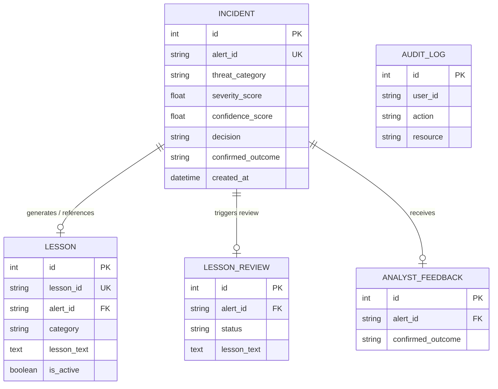

# ASOC — Autonomous SOC Platform: Architecture & Analysis

## 1. Executive Summary
The ASOC Platform is a production-grade, self-evolving, multi-agent Security Operations Center (SOC) system. Its primary value proposition is to autonomously triage, investigate, and learn from security threats, effectively replacing manual SOC alert fatigue with an intelligent pipeline. Its core differentiator is the "Self-Correction Loop," where a Critic agent learns from past mistakes (false positives/negatives) and feeds embedded lessons into ChromaDB, allowing the Triage agent to dynamically adapt and reduce false positive rates over time.

## 2. Tech Stack & Infrastructure
- **Languages:** Python 3.11+ (Backend/Agents), TypeScript/JavaScript (Frontend)
- **Frameworks:** FastAPI (REST API), LangGraph (Multi-Agent Orchestration), React (Dashboard)
- **Databases & Stores:**
  - **PostgreSQL (SQLAlchemy & Alembic):** Relational store for incidents, lesson approvals, audit logs, and feedback.
  - **ChromaDB:** Vector database for semantic search and storage of "lessons learned."
  - **Redis:** Caching, LangGraph state checkpointing, and Pub/Sub for Server-Sent Events (SSE).
  - **ClickHouse:** OLAP database for fast querying of 72h forensic events.
- **Message Broker:** Kafka (Confluent) for asynchronous raw log ingestion and stream processing.
- **Machine Learning:** PyTorch, Transformers, Sentence-Transformers, SecBERT (Threat classification).
- **Observability:** Prometheus, Grafana, OpenTelemetry, Sentry.
- **Infrastructure:** Docker Compose (local dev), Kubernetes/Helm/Terraform (production deployment).

## 3. High-Level Architecture

```mermaid
graph TD
    %% External Inputs
    SIEM[SIEM/Firewall/Endpoint] -->|Raw Logs| Kafka[Kafka: security.raw_logs]
    API_Client[API Client] -->|POST /alerts| API[FastAPI Web Server]
    
    %% Ingestion Layer
    Kafka --> Kafka_Consumer[Kafka Consumer Worker]
    Kafka_Consumer --> Normalizer[CEF / Syslog / WinEvt Normalizer]
    API --> GraphApp[LangGraph Pipeline]
    Normalizer --> GraphApp

    %% Multi-Agent LangGraph Pipeline
    subgraph LangGraph Multi-Agent Pipeline
        Triage[Triage Agent\n(SecBERT)]
        RiskGate{Risk Gate\nConf < 0.70?}
        Forensics[Forensics Agent\n(NetworkX)]
        BlastRadius[Blast Radius Agent\n(BFS/VaR)]
        Decision[Decision Node]
        Critic[Critic Agent\n(Claude/GPT-4)]
        HumanEscalation[Human Escalation]

        Triage --> RiskGate
        RiskGate -- Yes --> HumanEscalation
        RiskGate -- No --> Forensics
        Forensics --> BlastRadius
        BlastRadius --> Decision
        Decision --> |If Auto-decided| Critic
    end

    %% Storage & Learning
    ChromaDB[(ChromaDB\nVector Store)]
    PG[(PostgreSQL\nRelational Data)]
    Redis[(Redis\nState Checkpoints)]
    ClickHouse[(ClickHouse\nForensics Events)]

    Triage <-->|Retrieve Lessons| ChromaDB
    Critic -->|Embed New Lessons| ChromaDB
    GraphApp <-->|Save State| Redis
    Forensics <-->|Query 72h Logs| ClickHouse
    GraphApp -->|Save Incident| PG
```

## 4. Directory Structure Guide
The repository follows a clean, modular monolith structure:
- `agents/`: Contains the intelligence layer. Defines LangGraph agents (`triage`, `forensics`, `blast_radius`, `critic`), state management (`orchestrator`), and shared utilities (LLM clients, MITRE mapping, ChromaDB clients).
- `api/`: The presentation layer. A FastAPI application defining routes (`routers/`), models (`schemas/`), and advanced middleware (Audit, Auth, Correlation, Rate Limiting).
- `config/`: Application configuration using Pydantic Settings.
- `dashboard/`: React frontend providing the user interface for SOC analysts.
- `data/`: The data layer. Contains the PostgreSQL SQLAlchemy ORM models, Kafka consumers/producers, ClickHouse clients, and log normalizers (CEF, Syslog, Windows Event).
- `infra/`: Infrastructure-as-Code. Contains Kubernetes manifests, Helm charts, Terraform scripts, and Prometheus/Grafana monitoring configurations.
- `ml/`: Scripts and notebooks for SecBERT fine-tuning and drift detection.
- `scripts/`: Development and administrative scripts for seeding data, backfilling, and simulations.
- `tests/`: Pytest suite (unit and integration tests).

## 5. Data Model Overview
The core relational data is housed in PostgreSQL. The `Incident` table serves as the primary system of record for each processed alert, while `Lesson`, `LessonReview`, and `AnalystFeedback` drive the self-correction learning loop.



## 6. API & Integration Boundaries
- **RESTful API (FastAPI):** Exposes endpoints under `/alerts`, `/incidents`, `/lessons`, `/reviews`, and `/auth`.
- **Server-Sent Events (SSE):** Streaming API at `/stream/{alert_id}` for real-time frontend updates as the LangGraph pipeline progresses.
- **Kafka Event Streaming:** Consumes from `security.raw_logs`. A robust worker handles DLQ (Dead Letter Queues), exponential backoff, and at-least-once delivery guarantees.
- **Integrations:** Anthropic/OpenAI via API keys for the Critic agent, and local HuggingFace embeddings for ChromaDB vector search.

## 7. Deployment & CI/CD
- **Containerization:** The platform is fully containerized using a multi-target `Dockerfile` (API, Worker, Dashboard).
- **Local Dev:** `docker-compose.yml` spins up the entire stack including Kafka, Zookeeper, Redis, PostgreSQL, ClickHouse, ChromaDB, Prometheus, and Grafana.
- **CI/CD:** Governed by GitHub Actions (`.github/workflows/ci.yml`). Tests run via `pytest` with a mandatory 70% coverage floor. Linting uses `ruff` and `mypy`.
- **Production Infrastructure:** Designed for Kubernetes deployment (configurations stored in `infra/k8s`).

## 8. Key Entry Points
- **API Server:** `api/main.py` (FastAPI initialization and middleware wiring)
- **Background Worker:** `data/kafka/consumer.py` (Kafka consumer loop polling raw logs and triggering LangGraph)
- **Agent Orchestrator:** `agents/orchestrator/graph.py` (The LangGraph `StateGraph` definition and risk-gate routing)
- **Triage Agent:** `agents/triage/agent.py` (The main entry point of the AI pipeline, invoking SecBERT and ChromaDB)
- **Database Models:** `data/postgres/models.py` (SQLAlchemy ORM mappings)
- **Dev CLI Commands:** Governed by the `Makefile` (e.g., `make dev`, `make seed`, `make simulate`)
